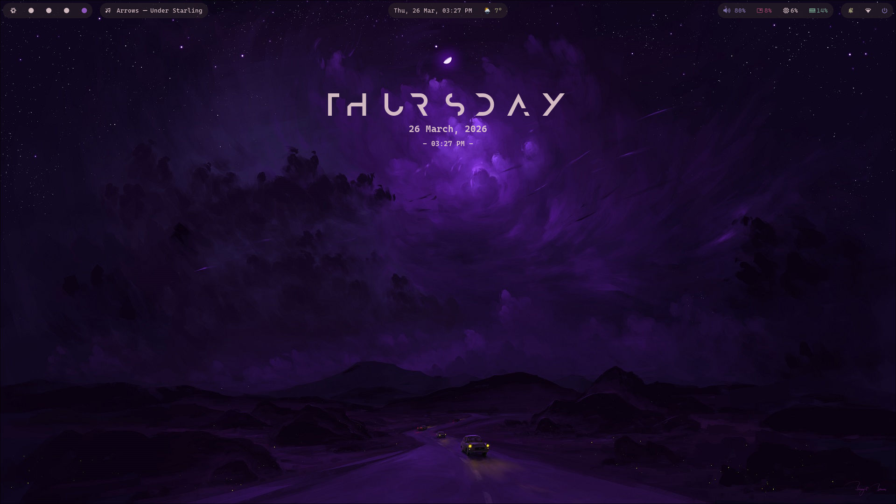
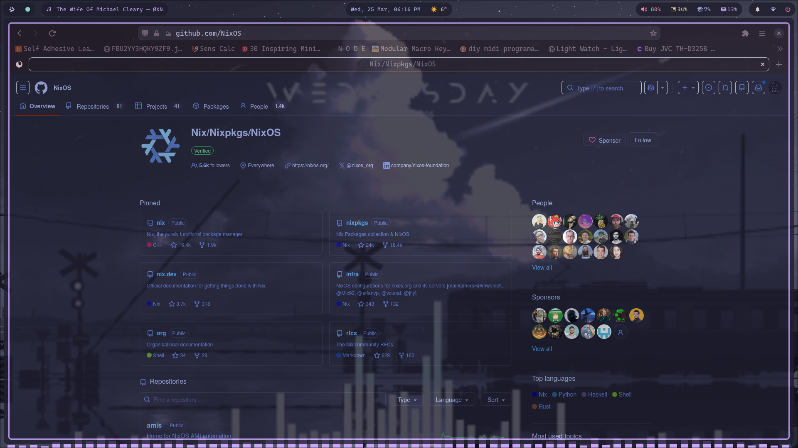
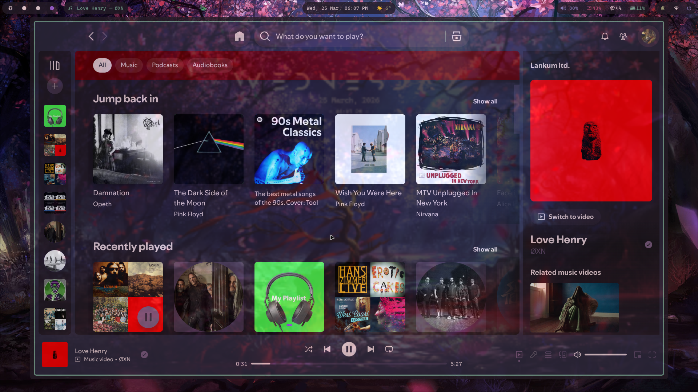
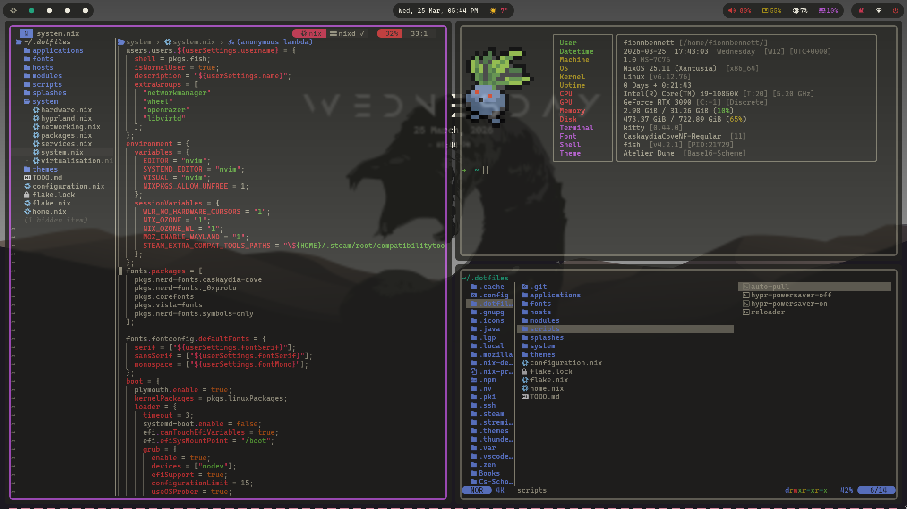
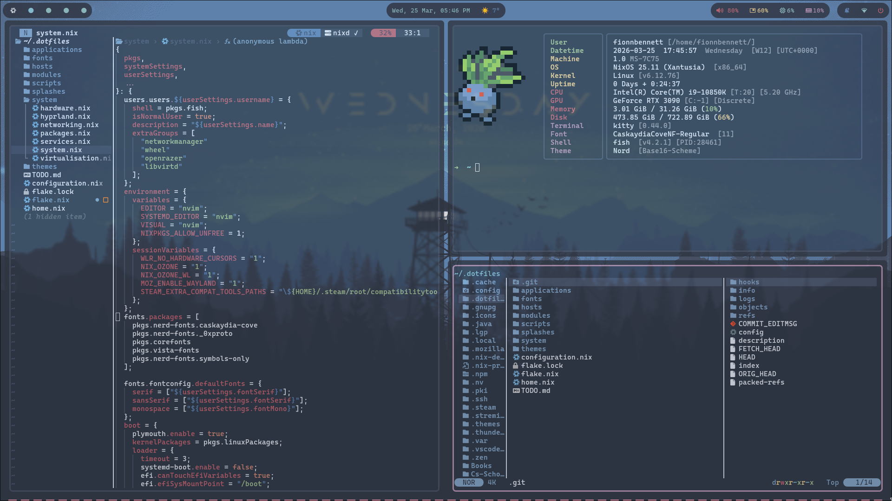
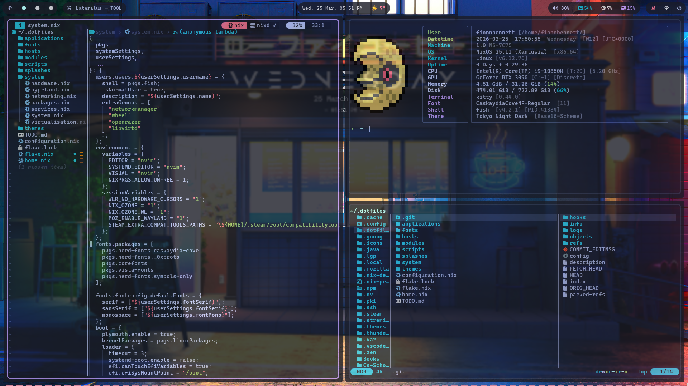
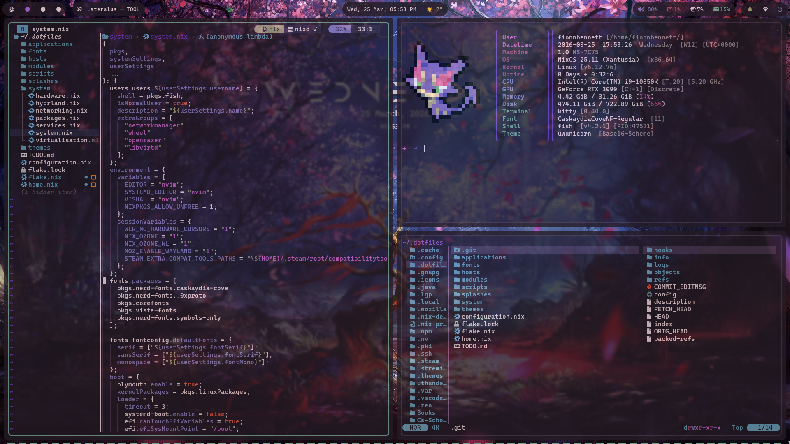
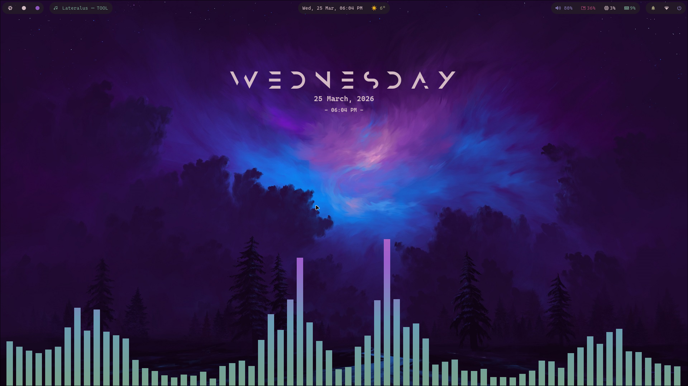

Name: Fionn Bennett
CAO: 26580249
Project Title: Designing a Declarative, Immutable Operating system
Repository: https://github.com/the-pint-sized-powerhouse/ISE-Project

# ISE Project

## Overview

This project is a custom, fully reproducible operating system built on NixOS. NixOS is a unique Linux distribution which uses a functional approach to system and package management. In a more traditional operating system such as one based Debian, software is installed imperatively and configuration files are scattered across the system. In my operating system, the entire system is declared in the Nix programming language and stored in this repository.

  <a target="_blank">

The entire system is anchored around the Nix Fake, the flake handles all of the inputs (package repositories and speciality programs) and the outputs (system configurations and variables), locking each inputs version in the flake.lock file. I chose Hyprland, a Wayland-based dynamic tiling window manager, as my desktop environment, and I used Home-Manager to manage the settings and theming of over 34 user-specified applications. This includes things such as the terminal, browser, and my Git settings. Lastly I used the Stylix module to apply a universal Base16 colour scheme across the entire operating system automatically.

## Motivation

The reason for this project is the result of my increasing frustration with modern operating systems such as Windows 11 and macOS. The trade off of functionality and performance for bloatware and data collection led to me searching for alternatives. Initially the thought of a lightweight Linux distribution appealed to me and I settled on Gentoo after a bit of experimentation with other distros. While I enjoyed the flexibility of compiling my own software from source, customising each install with USE flags, the long compile times became a serious burden on my productivity and creativity.

  <a target="_blank">

I eventually discovered NixOS when reading an article on immutable design. NixOS offers a great compromise, it has pre-compiled binary caching, a reasonably lightweight footprint, and a declarative package manager, ensuring reproducibility. The creation of this project has led to me taking full control of my computers and it ensures that I will never need to set up a new OS from scratch ever again.

## The Impact

The biggest impact of this project has been the complete restructuring of how I interact with my computers. 1. Total Reproducibility: As my entire OS is defined in a GitHub repository, I have the ability to deploy my exact system on any compatible x86 machine in a matter of minutes. The flake.lock file ensures that all dependencies are strictly locked to specific versions, this eliminates the infamous “it works on my machine” comments when attempting to a solve a niche issue on a GitHub issues thread. 2. Resilience: NixOS usses an atomic update model. If I was to write a configuration that breaks the system, I have the option to simply roll back to a previous, functional state from within the bootloaders launch menu. The ability to roll back has given me the freedom to experiment with different low level-system configurations without the fear of destroying my operating system and the data contained within it. 3. Productivity: I have always been frustrated with the manual, mouse-heavy management of windows on other operating systems. Upon researching alternatives I discovered the world of dynamic tiling window managers. I chose Hyprland as it is Wayland based (X11 has been largely fazed out by larger Desktop Environments such as Gnome and KDE), and it contains options for aesthetic customisation such as background opacity and blurring, coloured borders, and animations. Hyprland automatically tiles windows into a grid so that they never overlap, and the workflow is strictly keyboard oriented, this means that I never have to remove my hands from the keyboard as a move between windows and workspaces.

  <a target="_blank">

## Challenges

The most significant challenge I face when designing the operating system was its monolithic configuration structure. Early in development I had declared the entire system in a single, massive file, which was extremely difficult to navigate and read. My solution was the adoption of a new design philosophy. I applied the UNIX Design Philosophy, this philosophy dictates that code should “do one thing and do it well”. I completely reformatted the codebase, modularising the files into separate directories such as system/, modules/, and themes/. Each Nix file has been designed to manage one component of the system, I then bring them all together using the the Nix languages imports system. This modularisation isolated error messages to specific files and made my operating system much easier to modify and debug.

## Achievement

My proudest achievement was implementing my declarative configuration of NeoVim using the NixVim module (modules/nixvim/). Instead of configuring the editor using Lua, I used Nix to build a fully functional IDE entirely within the terminal. I implemented LSPs for code completion, a file browsing side bar, a markdown environment, custom keymaps and many other features (found within the plugins folder of modules/nixvim/).

## Gallery

  <a target="_blank">

  <a target="_blank">

  <a target="_blank">

  <a target="_blank">

  <a target="_blank">

